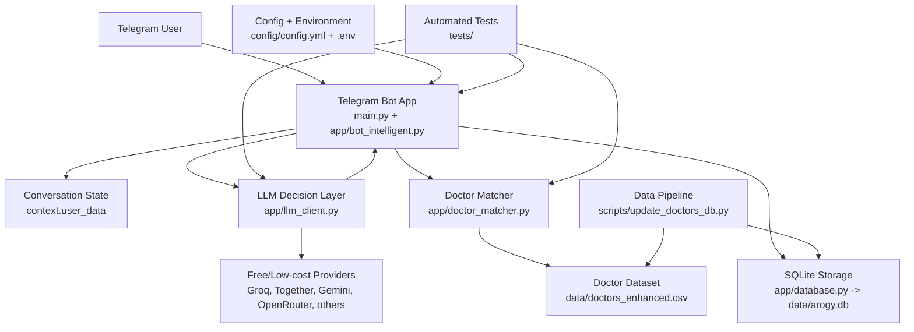

# Arogyamitra Medical Bot

Zero-cost AI-powered medical triage chatbot MVP for Telegram.

[](https://www.python.org/downloads/)
[](https://opensource.org/licenses/MIT)

## What This Project Is

Arogyamitra is a Telegram-based medical triage assistant designed to stay as close to free as possible for MVP use.

The current MVP:

- collects user demographics and symptom details through chat
- uses an LLM to decide the next question or final specialty recommendation
- matches users to doctors from a local doctor dataset
- stores users and consultation logs in SQLite
- runs with CSV + SQLite + free-tier LLM providers

The goal is not to provide diagnosis or treatment. The goal is to guide a user toward the most relevant doctor or specialty safely and quickly.

## MVP Scope

The active MVP is intentionally narrow:

- Channel: Telegram
- Runtime: local machine or free-tier hosting
- Data store: CSV + SQLite
- AI providers: free-tier-first fallback chain
- Output: doctor/specialty recommendation with disclaimer

Out of scope for the current MVP:

- booking and payments
- Google Maps integration
- WhatsApp launch path
- managed cloud database

## System Overview

At runtime, the system works like this:

1. A Telegram user starts a consultation.
2. The bot collects information through a guided conversation.
3. The LLM decides what to ask next and extracts structured details.
4. Once enough data is collected, the app determines the likely specialty.
5. The doctor matcher ranks doctors from the local dataset.
6. The bot sends doctor cards and a disclaimer.
7. User and consultation data are stored in SQLite.

## Block Diagram



## Active Repository Structure

This repository was cleaned up so there is one active build and a clearer repo contract.

```text
arogy_bot/
|-- app/
|   |-- bot_intelligent.py
|   |-- config.py
|   |-- database.py
|   |-- doctor_matcher.py
|   `-- llm_client.py
|-- config/
|   `-- config.yml
|-- data/
|   |-- arogy.db
|   |-- doctors_clean.csv
|   |-- doctors_enhanced.csv
|   `-- doctors_sample.csv
|-- docs/
|   |-- 01_setup/
|   |-- 02_architecture/
|   |-- 03_planning/
|   |-- 04_llm_research/
|   |-- 05_testing/
|   `-- README.md
|-- scripts/
|   `-- update_doctors_db.py
|-- tests/
|   |-- test_doctor_matcher.py
|   |-- test_llm_client.py
|   `-- test_update_doctors_db.py
|-- main.py
|-- pytest.ini
|-- requirements.txt
`-- README.md
```

Supported working areas:

- `app/` contains the actual application logic
- `config/` contains YAML prompts and bot settings
- `data/` contains the active doctor data and local SQLite snapshot
- `scripts/` contains maintenance utilities
- `tests/` contains the supported automated test suite
- `docs/` contains setup, architecture, planning, and testing docs

Legacy `test_scripts/` is intentionally excluded from the supported `pytest` run.

## Core Files

- `main.py`
  Telegram bot entrypoint.
- `app/bot_intelligent.py`
  Main consultation flow and Telegram handlers.
- `app/llm_client.py`
  Provider initialization, fallback order, JSON-mode requests, and rate-limit handling.
- `app/doctor_matcher.py`
  Specialty and symptom-based doctor scoring with `exclude_keywords` protection.
- `app/database.py`
  SQLite storage for users and consultation logs.
- `config/config.yml`
  Messages, prompts, emergency keywords, and app defaults.
- `data/doctors_enhanced.csv`
  Canonical doctor dataset used by the active app.
- `scripts/update_doctors_db.py`
  Normalizes doctor data, regenerates derived files, and syncs SQLite.

## Doctor Data Pipeline

The doctor database update flow is local and repeatable.

Source of truth:

- `data/doctors_enhanced.csv`

Run the refresh pipeline:

```powershell
python scripts/update_doctors_db.py
```

This refreshes:

- `data/doctors_enhanced.csv`
- `data/doctors_clean.csv`
- `data/doctors_sample.csv`
- `data/arogy.db`
- `data/pipeline_report.json`

This keeps the MVP simple and free while still giving you a usable update pipeline for doctor data.

## How Doctor Matching Works

The doctor matcher uses a weighted search process:

1. Exclude doctors whose `exclude_keywords` conflict with the user symptom.
2. Boost exact or near-exact specialty matches.
3. Score `primary_symptoms`.
4. Score `secondary_symptoms`.
5. Fall back to legacy `Keywords` matching when needed.

This helps avoid obvious bad matches like a tooth pain case being routed to oncology.

## Quick Start

### Prerequisites

- Python 3.10+
- Telegram bot token
- At least one working LLM API key

### Setup

```powershell
git clone https://github.com/rasheedhaq/arogy_bot.git
cd arogy_bot
python -m venv .venv
.\.venv\Scripts\activate
pip install -r requirements.txt
Copy-Item .env.example .env
```

Then:

1. Fill in `.env`
2. Update `data/doctors_enhanced.csv` if needed
3. Run `python scripts/update_doctors_db.py`
4. Run `pytest`
5. Run `python main.py`

## Testing

The supported automated suite runs from `pytest.ini`.

Run:

```powershell
pytest -q
```

Current supported tests cover:

- doctor matcher behavior
- LLM fallback behavior
- doctor data pipeline behavior

## Free MVP Launch Path

Recommended launch path:

1. Keep the product Telegram-only.
2. Use the local CSV + SQLite setup.
3. Enable only free-tier LLM providers in `.env`.
4. Validate with `pytest`.
5. Run one real Telegram end-to-end conversation test.
6. Deploy only after local and real-chat validation pass.

Recommended free/low-cost hosting options:

- Railway
- Render
- Fly.io

## Documentation Map

- `docs/README.md`
  Documentation index
- `docs/01_setup/`
  Setup and deployment
- `docs/02_architecture/`
  Architecture and protocol notes
- `docs/03_planning/`
  MVP readiness, database pipeline, roadmaps
- `docs/04_llm_research/`
  Provider research and rate-limit notes
- `docs/05_testing/`
  Test reports and testing guidance

Useful planning docs:

- `docs/03_planning/MVP_READINESS.md`
- `docs/03_planning/DATABASE_PIPELINE.md`

## Safety Notes

- This bot is not a substitute for medical advice.
- Emergency messages are handled separately using configured emergency keywords.
- The system should always display a disclaimer with recommendations.
- Real patient data should not be committed to the repository.

## Current Status

Current direction:

- active MVP codebase is stable and testable
- doctor data refresh pipeline is in place
- repository structure is cleaned for easier launch work
- branch workflow continues on `v2-refactor-improvements`

## License

MIT License.
